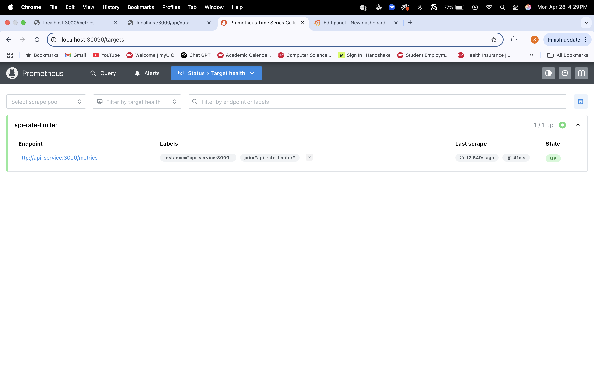

# API Rate Limiter with Prometheus and Grafana Monitoring

🚀 API Rate Limiter with Prometheus and Grafana Monitoring is a cloud-native backend system designed to control client request rates and ensure system stability. The project uses Node.js and Redis to implement fast, scalable rate limiting, while Prometheus and Grafana provide real-time monitoring and visualization. The entire system is containerized with Docker and orchestrated using Kubernetes, simulating a production-grade deployment setup.

---

## 🔥 Tech Stack

- **Backend**: Node.js + Express.js
- **Data Store**: Redis
- **Monitoring**: Prometheus, Grafana
- **Containerization**: Docker
- **Orchestration**: Kubernetes (Minikube)
- **Visualization**: Grafana Dashboards

---

## 📊 System Architecture

```plaintext
Browser / Client
        ↓
  Kubernetes Cluster
        ↓
┌─────────────────────┬─────────────────────┐
│  API Server (Node.js)│  Redis (Rate Limiting)│
└─────────────────────┴─────────────────────┘
        ↓
 Prometheus (Scraping API Metrics)
        ↓
 Grafana (Real-time Dashboards)

✨ Features
	•	⏳ Rate Limiting: 5 requests per minute per IP address
	•	🚫 429 Too Many Requests: with Retry-After header
	•	📈 Real-time Monitoring: API requests by status codes (200 OK / 429 Rate Limited)
	•	📊 Grafana Dashboards: Live traffic visualization
	•	⚙️ Full Kubernetes Deployment: API, Redis, Prometheus, Grafana
	•	🐳 Dockerized: Easy local development and deployment

⚙️ Setup Instructions:

1. Clone the repository:
git clone https://github.com/SuryaBeeraka/API-Rate-Limiter-with-Prometheus-and-Grafana-monitoring.git
cd API-Rate-Limiter-with-Prometheus-and-Grafana-monitoring

2. Install Node.js and run locally:
npm install && node server.js

3. Build Docker Image:
docker build -t suryabeeraka/api-rate-limiter:latest .
docker push suryabeeraka/api-rate-limiter:latest

4.Deploy on Kubernetes:
kubectl apply -f k8s/redis-deployment.yaml
kubectl apply -f k8s/prometheus/prometheus-deployment.yaml
kubectl apply -f k8s/grafana/grafana-deployment.yaml
kubectl apply -f k8s/api-deployment.yaml

5. Run these commands in different terminarls:
kubectl port-forward service/api-service 3000:3000
kubectl port-forward service/prometheus-service 30090:9090
kubectl port-forward service/grafana-service 3001:3000
minikube tunnel

6. Access Services:
API
http://localhost:3000/api/data
Prometheus
http://localhost:30090
Grafana
http://localhost:3001 (Login: admin/admin)

Below are the ScreenShots of my project:
### API Response


### Prometheus Targets Health


### Grafana API Traffic Dashboard


